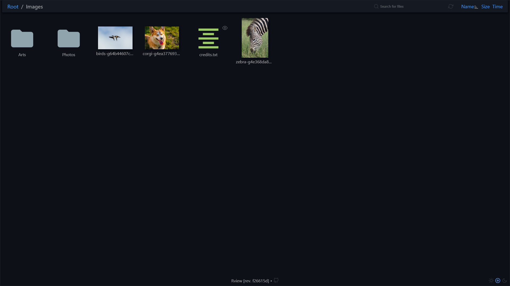

# `Rview` - web-based UI for Rclone

<p align="center">
  
  <br>
  <i> More screenshots <a href="./docs/Screenshots.md">here</a> </i>
</p>

***

- [Features](#features)
- [Limitations](#limitations)
- [Run](#run)
  - [With Demo Files](#with-demo-files)
  - [With Your Files](#with-your-files)
- [Configuration](#configuration)
- [Development](#development)
  - [API](#api)
  - [Metrics](#metrics)
- [Thanks](#thanks)

## Features

- :framed_picture: **Automatic thumbnail generation**: You don't have to download hundreds of MiBs to preview your photos.
  Image thumbnails are generated with the help of [libvips](https://github.com/libvips/libvips), an extremely
  fast image processing library.
- :mag: **Search**: You can search for files by name. Search tips can be found [here](./docs/Search.md).
- :iphone: **Responsive**: UI is designed to be responsive, which means you can browse you files on both desktop
  and mobile.
- :feather: **Lightweight & minimalistic**: All pages are rendered on the server side using Go templates. JavaScript
  is used only to make the UI interactive.

## Limitations

- **Rview** is read-only and there are no plans to change that. You should use Rclone directly
  to upload, edit, or delete files.
- **Rview** does not provide any authentication mechanism. It is therefore highly recommended to use a proxy
  such as Nginx or Caddy. Placing **Rview** behind a proxy also allows gzip compression, which sometimes can
  significantly improve response time.

## Run

### With Demo Files

1. You have to install [docker](https://docs.docker.com/).
2. Run this command:

   ```sh
   docker run --rm -p 8080:8080 ghcr.io/shoshinnikita/rview:main
   ```

4. Go to http://localhost:8080.

### With Your Files

1. You have to install [docker](https://docs.docker.com/) and [docker compose](https://docs.docker.com/compose/).
2. Let's consider you use Rclone S3 backend, and your `~/.config/rclone/rclone.conf` looks like this:

	```ini
	[my-s3]
	type = s3
	provider = Other
	access_key_id = <key id>
	secret_access_key = <access key>
	endpoint = <endpoint>
	```

3. Create `docker-compose.yml` with the following content:

	```yml
	version: "2"
	services:
	  rview:
	    image: ghcr.io/shoshinnikita/rview:main
	    container_name: rview
	    volumes:
	      - ./var:/srv/var                                          # mount app data directory
	      - ~/.config/rclone/rclone.conf:/config/rclone/rclone.conf # mount Rclone config file
	    ports:
	      - "127.0.0.1:8080:8080"
	    command: "--rclone-target=my-s3:" # pass Rclone target from the config file
	```

4. Run this command:

   ```sh
   docker compose up
   ```

5. Go to http://localhost:8080.

## Configuration

| Flag                             | Default Value              | Description                                  |
| -------------------------------- | -------------------------- | -------------------------------------------- |
| `--debug-log-level`              | `false`                    | display debug log messages                   |
| `--dir`                          | `./var`                    | directory for app data (thumbnails and etc.) |
| `--port`                         | `8080`                     | server port                                  |
| `--rclone-port`                  | `8181`                     | port of a rclone instance                    |
| `--rclone-target`                | no default value, required | rclone target                                |
| `--read-static-files-from-disk`  | `false`                    | read static files directly from disk         |
| `--thumbnails`                   | `true`                     | generate image thumbnails                    |
| `--thumbnails-max-age-days`      | `365`                      | max age of thumbnails, days                  |
| `--thumbnails-max-total-size-mb` | `500`                      | max total size of thumbnails, MiB            |
| `--thumbnails-workers-count`     | number of logical CPUs     | number of workers for thumbnail generation   |

## Development

First, you have to install the following dependencies:

1. [rclone](https://github.com/rclone/rclone) - instructions can be found [here](https://rclone.org/install/).
2. [libvips](https://github.com/libvips/libvips) - you can install it with this command:

	```bash
	sudo apt-get install libvips-tools
	```

After completion of these steps you should be able to run **Rview**:

```bash
# Build and run
make build && make run
# Or just
make

# Build, run tests and lint code
make check
```

By default `make run` uses environment variables from `.env` file. You can redefine these variables via `.env.local` file.

### API

API-endpoints exposed by **Rview**:

- `GET /api/dir/<path>?mod_time=<unix_time>` - get directory info
- `GET /api/file/<path>?mod_time=<unix_time>` - get original file
- `GET /api/thumbnail/<path>?mod_time=<unix_time>` - get image thumbnail
- `GET /api/search?search=<search>&dir-limit=3&file-limit=7` - search files by name
- `POST /api/search/refresh-indexes` - refresh search indexes

Response models can be found in [web/models.go](web/models.go).

### Metrics

**Rview** exposes Prometheus metrics on `/debug/metrics`. The list of all metrics can be found [here](pkg/metrics/metrics.go)

## Thanks

A special thanks to these open-source projects:

- [Material Icon Theme](https://github.com/PKief/vscode-material-icon-theme) - Material Design icons for VS Code.
- [Feather](https://github.com/feathericons/feather) - Simply beautiful open source icons.
