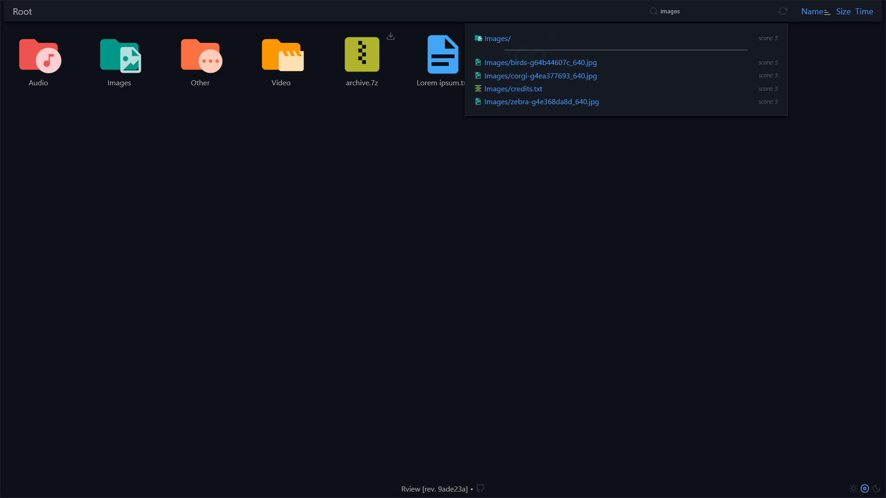

# Screenshots

- [Dirs \& Files](#dirs--files)
- [Previews](#previews)
  - [Image](#image)
  - [Text](#text)
  - [Video](#video)
- [Search](#search)
- [How to update screenshots](#how-to-update-screenshots)

## Dirs & Files

</img>
</img>

## Previews

### Image

</img>

### Text

</img>

### Video

</img>

## Search

</img>

## How to update screenshots

1. GitHub doesn't allow adding border to images - so, we have to add it manually. Just
   add the following code to `common.css`:

   ```css
   body,
   .preview-close-layer {
     border: 1px solid #21262d;
   }
   ```

   Note: `#21262d` is `var(--color-border-muted)` on GitHub.

2. Use `tests/testdata` as `RCLONE_TARGET`.
3. Remove files for testing corner-cases: `Images/vertical.jpg`, `test.gif` and so on.
4. Make `.png` screenshots.
5. Use this command to convert screenshots to `.jpg`:

   ```sh
   vipsthumbnail --size 1920x1080 -o %s.jpg[Q=90,optimize_coding] *.png
   ```

6. Remove `.png` screenshots:

   ```sh
   rm *.png
   ```
